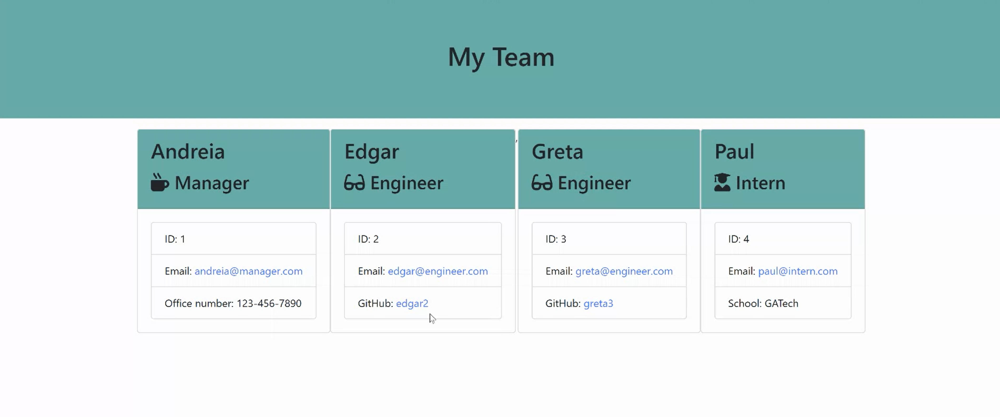

# Employee-Summary

The purpose of this application is to create a summary with basic information from a team of employees. The user responds to a series of prompts asking for specific information about each team member based on their role in the company. The user can add as many team members as needed. When all the members have been added, an html file is created and a web page is displayed with information of each team member. 

Please click on the image below to watch a video demo of the application.

